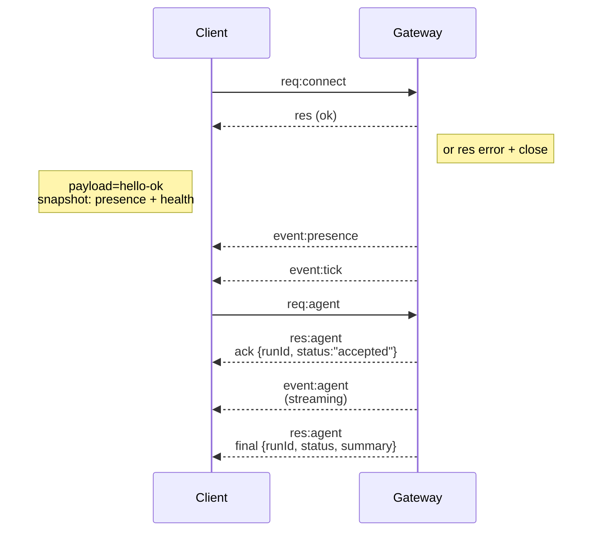

# Gateway architecture

Last updated: 2026-01-22

## Overview

- A single long‑lived **Gateway** owns all messaging surfaces (WhatsApp via
  Baileys, Telegram via grammY, Slack, Discord, Signal, iMessage, WebChat).
- Control-plane clients (macOS app, CLI, web UI, automations) connect to the
  Gateway over **WebSocket** on the configured bind host (default
  `127.0.0.1:18789`).
- **Nodes** (macOS/iOS/Android/headless) also connect over **WebSocket**, but
  declare `role: node` with explicit caps/commands.
- One Gateway per host; it is the only place that opens a WhatsApp session.
- The **canvas host** is served by the Gateway HTTP server under:
  - `/__openclaw__/canvas/` (agent-editable HTML/CSS/JS)
  - `/__openclaw__/a2ui/` (A2UI host)
    It uses the same port as the Gateway (default `18789`).

## Components and flows

### Gateway (daemon)

- Maintains provider connections.
- Exposes a typed WS API (requests, responses, server‑push events).
- Validates inbound frames against JSON Schema.
- Emits events like `agent`, `chat`, `presence`, `health`, `heartbeat`, `cron`.

### Clients (mac app / CLI / web admin)

- One WS connection per client.
- Send requests (`health`, `status`, `send`, `agent`, `system-presence`).
- Subscribe to events (`tick`, `agent`, `presence`, `shutdown`).

### Nodes (macOS / iOS / Android / headless)

- Connect to the **same WS server** with `role: node`.
- Provide a device identity in `connect`; pairing is **device‑based** (role `node`) and
  approval lives in the device pairing store.
- Expose commands like `canvas.*`, `camera.*`, `screen.record`, `location.get`.

Protocol details:

- [Gateway protocol](/gateway/protocol)

### WebChat

- Static UI that uses the Gateway WS API for chat history and sends.
- In remote setups, connects through the same SSH/Tailscale tunnel as other
  clients.

## Connection lifecycle (single client)



## Wire protocol (summary)

- Transport: WebSocket, text frames with JSON payloads.
- First frame **must** be `connect`.
- After handshake:
  - Requests: `{type:"req", id, method, params}` → `{type:"res", id, ok, payload|error}`
  - Events: `{type:"event", event, payload, seq?, stateVersion?}`
- If `OPENCLAW_GATEWAY_TOKEN` (or `--token`) is set, `connect.params.auth.token`
  must match or the socket closes.
- Idempotency keys are required for side‑effecting methods (`send`, `agent`) to
  safely retry; the server keeps a short‑lived dedupe cache.
- Nodes must include `role: "node"` plus caps/commands/permissions in `connect`.

## Pairing + local trust

- All WS clients (operators + nodes) include a **device identity** on `connect`.
- New device IDs require pairing approval; the Gateway issues a **device token**
  for subsequent connects.
- **Local** connects (loopback or the gateway host’s own tailnet address) can be
  auto‑approved to keep same‑host UX smooth.
- All connects must sign the `connect.challenge` nonce.
- **Non‑local** connects still require explicit approval.
- Gateway auth (`gateway.auth.*`) still applies to **all** connections, local or
  remote.

Details: [Gateway protocol](/gateway/protocol), [Pairing](/channels/pairing),
[Security](/gateway/security).

## Protocol typing and codegen

- TypeBox schemas define the protocol.
- JSON Schema is generated from those schemas.
- Swift models are generated from the JSON Schema.

## Remote access

- Preferred: Tailscale or VPN.
- Alternative: SSH tunnel

  ```bash
  ssh -N -L 18789:127.0.0.1:18789 user@host
  ```

- The same handshake + auth token apply over the tunnel.
- TLS + optional pinning can be enabled for WS in remote setups.

## Operations snapshot

- Start: `openclaw gateway` (foreground, logs to stdout).
- Health: `health` over WS (also included in `hello-ok`).
- Supervision: launchd/systemd for auto‑restart.

## Invariants

- Exactly one Gateway controls a single Baileys session per host.
- Handshake is mandatory; any non‑JSON or non‑connect first frame is a hard close.
- Events are not replayed; clients must refresh on gaps.
